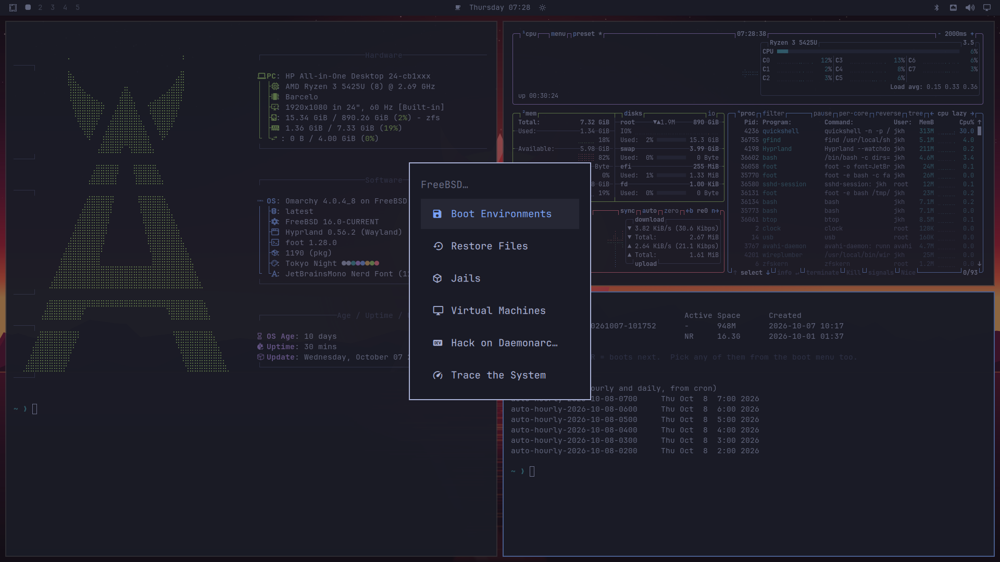
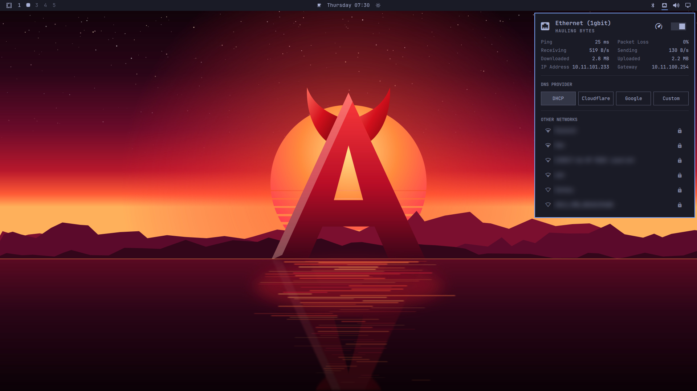
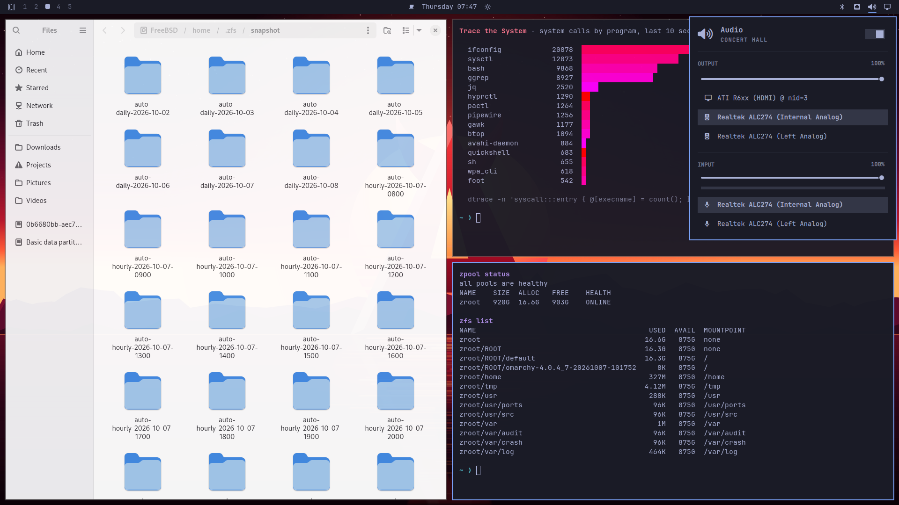

# Getting started with Daemonarchy

This guide takes you from a download to a working desktop, and through the things you will do in your first hour: get online, play sound, pair a keyboard, keep the system up to date, and use what FreeBSD adds. You do not need to know FreeBSD or Omarchy already.

Daemonarchy is the [Omarchy](https://omarchy.org) desktop running on [FreeBSD](https://www.freebsd.org). If you are curious how it is put together, or want to change it, read the [hacking guide](../HACKING.md) when you are done here.

## What you need

- A 64-bit PC (x86-64) that boots with **UEFI**. Most machines made since 2015 do.
- A USB stick of 4 GB or more. Writing the image erases it.
- A disk of 20 GB or more that Daemonarchy can have to itself. **The whole disk is erased**; Daemonarchy does not share a disk with Windows or Linux.
- A network connection during the install: wired Ethernet, or Wi-Fi with a password (WPA2 or WPA3) or none. Company Wi-Fi that asks for a user name as well (802.1X, "enterprise") does not work in the installer.
- An AMD or Intel graphics chip. NVIDIA graphics are not supported yet.

## 1. Download the image

Get the `.iso` file and its `.sha256` checksum from the [latest release](https://github.com/jordanhubbard/daemonarchy/releases/latest).

Checking the download is optional but quick. In a terminal, in the folder you saved both files to:

- macOS: `shasum -a 256 -c daemonarchy-*.iso.sha256`
- Linux: `sha256sum -c daemonarchy-*.iso.sha256`
- FreeBSD: `sha256 -c "$(cut -d' ' -f1 daemonarchy-*.iso.sha256)" daemonarchy-*.iso`
- Windows (PowerShell): `Get-FileHash daemonarchy-*.iso`, then compare the result with the number in the `.sha256` file.

## 2. Write it to a USB stick

The image is copied to the stick byte for byte; copying the file onto the stick like a document does not work.

- **Any system, the easy way:** [balenaEtcher](https://etcher.balena.io). Pick the `.iso`, pick the stick, press Flash.
- **Windows:** [Rufus](https://rufus.ie) works too; when it asks, choose **DD image mode**.
- **macOS:** find the stick with `diskutil list` (say it is `/dev/disk4`), then `diskutil unmountDisk /dev/disk4` and `sudo dd if=daemonarchy-1.0.0-amd64.iso of=/dev/rdisk4 bs=1m`.
- **Linux:** find the stick with `lsblk` (say `/dev/sdb`), then `sudo dd if=daemonarchy-1.0.0-amd64.iso of=/dev/sdb bs=1M status=progress conv=fsync`.

Be sure of the device name: `dd` overwrites whatever you point it at.

## 3. Boot from the stick

1. Plug the stick in and turn the machine on, pressing its boot menu key (often F12, F11, F10 or Esc; on Macs hold Option).
2. If the stick is not offered, enter the firmware setup (often F2 or Del) and **turn Secure Boot off**. Daemonarchy's boot loader is not signed for Secure Boot yet.
3. Choose the USB stick, in UEFI mode if it is listed twice.

## 4. Install

The installer asks a handful of questions, then installs on its own. Use the arrow keys, Tab and Enter.

1. **Welcome.** Press Enter to begin.
2. **Keyboard.** Pick your keyboard layout.
3. **Your account.** Your name, a user name, a password (you will log in with it, and give it when the system asks for your permission), a name for the computer, and your time zone.
4. **Network.** The installer lists your network adapters. A plugged-in cable is usually already connected; otherwise pick **Join Wi-Fi**, choose your network and type its password. You can also set an address by hand if your network has no DHCP.
5. **Remote access.** Say yes only if you want to log in to this machine from another one over SSH.
6. **Disk.** Pick the disk to install on, and whether to **encrypt** it. Encryption means typing your password each time the machine starts, and keeps your files safe if the machine is lost.
7. **Ready.** Check the summary and confirm. The disk is erased from here on.

The install downloads about 1,200 packages, so it takes from 15 minutes to an hour depending on your connection. When it is done, remove the stick and restart.

## 5. Log in

The login screen already has your user name; type your password and press Enter. The first login takes a few seconds longer while your desktop is set up.

## 6. Find your way around

Everything starts from the keyboard. The key with the Windows or Command logo is called **Super**.

| Keys | What it does |
|---|---|
| Super + Space | The Daemonarchy menu: apps, settings, setup, updates, FreeBSD tools |
| Super + K | Every keyboard shortcut, searchable |
| Super + Return | Terminal |
| Super + Shift + B | Web browser |
| Super + Shift + F | Files |
| Super + W | Close the window |
| Super + 1 ... 9 | Switch workspace (Super + Shift + number moves the window there) |
| Super + T | Float or tile the window |
| Super + F | Full screen |
| Print Screen | Screenshot |
| Super + Ctrl + L | Lock the screen |
| Super + Escape | Log out, restart, shut down |

Windows tile themselves side by side as you open them; there is nothing to drag. The bar at the top shows your workspaces, the time, and icons for network, sound and Bluetooth: click one to open its panel.

## 7. Get online

Open the network panel with **Super + Ctrl + W**, or click the network icon in the bar.

- With a cable plugged in you are already online.
- For Wi-Fi, turn **Wi-Fi** on (the first time, this sets up your Wi-Fi card), pick a network, and type its password. Daemonarchy remembers it and reconnects by itself.
- To forget a network, highlight it and choose **Forget**.

If no Wi-Fi switch appears, FreeBSD has no driver for your Wi-Fi card; a USB Wi-Fi adapter or a cable will get you going.

## 8. Sound

Open the sound panel with **Super + Ctrl + A**, or click the speaker icon. Pick where sound plays (speakers, headphones, HDMI) and which microphone records, and set the volume. The volume keys on your keyboard work as well.

## 9. Bluetooth keyboards and mice

Open the Bluetooth panel with **Super + Ctrl + B**, or click the Bluetooth icon.

1. Turn Bluetooth on.
2. Put your keyboard or mouse into pairing mode (usually by holding its connect button until a light blinks).
3. Pick it from the list of devices found. Once paired it reconnects by itself.

FreeBSD's Bluetooth handles keyboards, mice and other input devices. **Bluetooth headphones and speakers do not work on FreeBSD**, and neither do the newest "Low Energy" devices that never use classic Bluetooth; use a cable or a USB receiver for those.

## 10. Keep it up to date

Open the menu (**Super + Space**) and choose **Update**. Daemonarchy updates FreeBSD's packages and its own in one go, and before it changes anything it saves a **boot environment**: a snapshot of the whole system you can go back to if an update goes wrong (see below).

In a terminal, `sudo pkg upgrade` does the same for packages.

## 11. What FreeBSD adds

Open the menu and go to **System > FreeBSD**.

- **Boot Environments:** every update first saves a bootable copy of the system. If something breaks, pick an earlier one here (or from the boot menu at startup) and restart into it.
- **Restore Files:** your home folder is snapshotted every hour and every day. Browse a snapshot and copy back a file you deleted or changed by mistake.
- **Jails:** lightweight FreeBSD containers, each with its own packages, for trying things out without touching your system.
- **Virtual Machines:** run Linux, Windows or another BSD in a window, with bhyve.
- **Trace the System:** live views of what programs, files, disks and the network are doing, with DTrace.
- **Hack on Daemonarchy:** run the desktop from your own copy of its source code (see the [hacking guide](../HACKING.md)).

## 12. AI coding tools

Daemonarchy can set up Claude Code, Codex, Cursor and others for you: open the menu, go to **Setup > Defaults > Agent**, and pick one, or just type its name (`claude`, `codex`, `cursor-agent`, ...) in a terminal. Each is downloaded the first time you use it.

## When something goes wrong

- **The machine will not boot the stick:** check that Secure Boot is off and you chose the UEFI entry.
- **The install stopped:** the screen shows the end of the install log. Most stops are network trouble; restart and try again, or use a cable. The full log is `/tmp/daemonarchy-install.log` on the installer system.
- **A black screen after login on a virtual machine:** expected. The desktop needs a real graphics chip.
- **An update broke something:** restart, choose an earlier boot environment in the boot menu, and you are back where you were.
- **Anything else:** [open an issue](https://github.com/jordanhubbard/daemonarchy/issues) with what you did and what you saw.

## Going further

- [The hacking guide](../HACKING.md): how Daemonarchy is built, how to change it, and how to build your own image.
- The source: [daemonarchy](https://github.com/jordanhubbard/daemonarchy) (the installer), [daemonarchy-desktop](https://github.com/jordanhubbard/daemonarchy-desktop) (Daemonarchy's look and FreeBSD tools) and [omarchy-freebsd](https://github.com/jordanhubbard/omarchy-freebsd) (what lets Omarchy run on FreeBSD).
- [Omarchy's manual](https://learn.omacom.io/2/the-omarchy-manual) for the desktop itself; nearly all of it applies here.
- [The FreeBSD Handbook](https://docs.freebsd.org/en/books/handbook/) for the operating system underneath.
